# 📊 Diagrama Modelo Entidad-Relación (MeR) — ActuemosYaColombia

Este documento describe formalmente el modelo entidad-relación y las relaciones de datos de la plataforma humanitaria **ActuemosYaColombia (AYC)**, diseñado para operar sobre **SQLite** en modo **WAL (Write-Ahead Logging)**.

---

## 1. Diagrama MeR (Mermaid)

```mermaid
erDiagram
    USUARIOS {
        string id PK "UUID / CUID"
        string email UK "Email único institucional o supervisor"
        string nombre "Nombre completo"
        string rol "CHECK: admin | supervisor"
        int activo "1: Aprobado | 0: Pendiente"
        datetime creado_en "Fecha de registro"
    }

    AUTH_TOKENS {
        string id PK "UUID / CUID"
        string email "Email del solicitante"
        string codigo_hash "Hash HMAC-SHA256 de OTP o Magic Link"
        string tipo "CHECK: login_admin | verificacion_idea | verificacion_comentario"
        string referencia_id "FK opcional a idea o comentario"
        datetime expira_en "Fecha y hora de expiración (15m)"
        int usado "1: Usado | 0: Vigente"
        datetime creado_en "Fecha de emisión"
    }

    IDEAS {
        string id PK "UUID / CUID"
        string titulo "Título de la propuesta ciudadana"
        string descripcion_markdown "Descripción enriquecida en Markdown"
        string categoria "Albergue, Salud, Rescate, Logística, etc."
        string alcance_tipo "CHECK: general | region | ciudad | grupo_especifico"
        string alcance_detalle "Detalle geográfico o poblacional"
        string estado "CHECK: borrador | idea | promovida | en_accion | cerrada | redirigida"
        string iniciativa_existente_url "URL externa si estado es redirigida"
        int es_anonimo "1: Anónimo | 0: Con correo"
        string email_creador "Email del creador o NULL"
        int verificado "1: Validado con OTP | 0: Pendiente"
        datetime creado_en "Fecha de creación"
        datetime actualizado_en "Fecha de última modificación"
    }

    COMENTARIOS {
        string id PK "UUID / CUID"
        string idea_id FK "ID de la idea comentada"
        string comentario_padre_id FK "ID del comentario padre (hilo anidado)"
        string contenido_markdown "Cuerpo del comentario en Markdown"
        int es_anonimo "1: Anónimo | 0: Con correo"
        string autor_email "Email del autor o NULL"
        int verificado "1: Validado | 0: Sin validar"
        string estado "CHECK: visible | oculto | pendiente_moderacion"
        datetime creado_en "Fecha de publicación"
    }

    INICIATIVAS_ACTIVAS {
        string id PK "UUID / CUID"
        string nombre "Nombre de la iniciativa / ONG / Campaña"
        string descripcion "Descripción de la labor en campo"
        string categoria "Salud, Víveres, Rescate, Refugio, etc."
        string url_oficial "Enlace web o red oficial"
        string contacto "Canal de contacto público"
        string cobertura_geografica "Cobertura nacional, departamental o local"
        string estado_operacion "CHECK: activa | pausada | completada"
        datetime creado_en "Fecha de registro"
    }

    REPORTES_BUSQUEDA {
        string id PK "UUID / CUID"
        string tipo "CHECK: persona | animal"
        string nombre "Nombre de la persona o mascota"
        string especie "Solo si tipo animal: perro, gato, etc."
        string descripcion_rasgos "Rasgos físicos, vestimenta, señas"
        string ubicacion "Última ubicación conocida o refugio"
        string foto_url "Ruta optimizada de la fotografía"
        string estado "CHECK: buscado | en_refugio | localizado | perdido | rescatado | en_hogar_temporal"
        string contacto_emergencia "Teléfono o canal de contacto"
        int verificado_por_supervisor "1: Verificado por moderador | 0: Sin verificar"
        datetime creado_en "Fecha de reporte"
    }

    VOLUNTARIADO_PROFESIONAL {
        string id PK "UUID / CUID"
        string tipo "CHECK: ofrezco_habilidad | busco_profesional"
        string area_profesional "Medicina, Arquitectura, Psicología, Software, etc."
        string titulo_necesidad "Título descriptivo de oferta o demanda"
        string descripcion "Detalles técnicos requeridos o brindados"
        string nombre_contacto "Persona u organización de contacto"
        string email_contacto "Email de contacto"
        string telefono_contacto "Teléfono de contacto"
        string ubicacion "Ciudad, departamento o remoto"
        string estado "CHECK: activo | cubierto | pausado"
        datetime creado_en "Fecha de publicación"
    }

    IDEAS ||--o{ COMENTARIOS : "posee hilos de debate"
    COMENTARIOS ||--o{ COMENTARIOS : "respuestas anidadas (hilo)"
    IDEAS ||--o| INICIATIVAS_ACTIVAS : "puede redirigirse a"
    IDEAS ||--o{ AUTH_TOKENS : "valida autoría vía OTP"
    USUARIOS ||--o{ AUTH_TOKENS : "recibe Magic Link"
```

---

## 2. Descripción de Entidades y Diccionario de Datos

### 2.1. `usuarios`
Gestiona el acceso de moderadores y administradores con privilegios en el sistema.
- **Relaciones:** Genera tokens de tipo `login_admin` en `auth_tokens`.
- **Integridad:** `email` es único. `activo` determina si el usuario fue habilitado por un Administrador.

### 2.2. `auth_tokens`
Tokens criptográficos de un solo uso con expiración estricta de 15 minutos.
- **Tipos de token:**
  - `login_admin`: Magic Link para acceso administrativo passwordless.
  - `verificacion_idea`: Código OTP de 6 dígitos para validar autoría de ideas.
  - `verificacion_comentario`: Código OTP para validar comentarios.

### 2.3. `ideas`
Núcleo del Banco de Ideas ciudadanas.
- **Ciclo de vida:** `borrador` ➔ `idea` ➔ `promovida` ➔ `en_accion` ➔ `cerrada` / `redirigida`.
- **Anti-Duplicación:** Si existe una iniciativa activa, el estado pasa a `redirigida` con `iniciativa_existente_url`.

### 2.4. `comentarios`
Hilos de discusión anidados asociados a cada idea.
- **Recursividad:** `comentario_padre_id` apunta a otro comentario de la misma idea permitiendo árboles de respuestas.
- **Cascada:** Al eliminarse una idea, sus comentarios se eliminan en cascada (`ON DELETE CASCADE`).

### 2.5. `iniciativas_activas`
Directorio de proyectos, ONGs y brigadas activas en el territorio nacional.

### 2.6. `reportes_busqueda`
Registro humanitario urgente de personas desaparecidas o albergadas, así como animales de compañía perdidos o rescatados.

### 2.7. `voluntariado_profesional`
Tablero bidireccional de oferta (`ofrezco_habilidad`) y demanda (`busco_profesional`) de talentos técnicos especializados.

---

## 3. Índices de Rendimiento (SQLite WAL)

Para garantizar tiempos de respuesta `<5ms` con bajo consumo de memoria:

| Índice | Tabla | Columnas | Propósito |
| :--- | :--- | :--- | :--- |
| `idx_ideas_estado` | `ideas` | `estado` | Filtrado rápido de ideas públicas, en acción o promovidas |
| `idx_ideas_alcance` | `ideas` | `alcance_tipo, alcance_detalle` | Búsqueda por ubicación o segmento poblacional |
| `idx_ideas_creado_en` | `ideas` | `creado_en DESC` | Orden cronológico en el feed principal |
| `idx_comentarios_idea` | `comentarios` | `idea_id, creado_en ASC` | Carga optimizada de hilos de debate |
| `idx_reportes_tipo_estado` | `reportes_busqueda` | `tipo, estado` | Filtros combinados de personas/animales y su estado |
| `idx_reportes_ubicacion` | `reportes_busqueda` | `ubicacion` | Búsquedas geográficas rápidas |
| `idx_voluntariado_area_tipo`| `voluntariado_profesional` | `area_profesional, tipo` | Matching de habilidades profesionales |
| `idx_auth_tokens_lookup` | `auth_tokens` | `email, tipo, usado, expira_en` | Validación rápida de OTPs y Magic Links |
